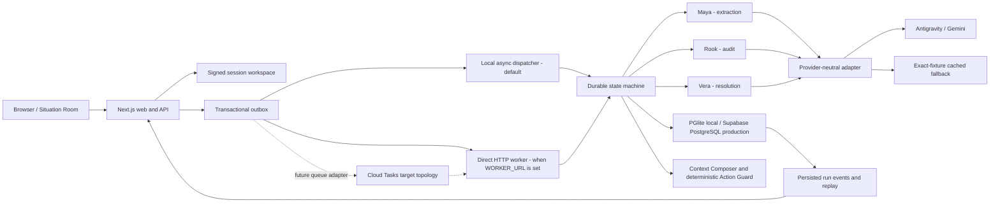

# GroundMesh

GroundMesh is a source-backed context-control layer for organizations using humans and AI agents. It turns incoming company evidence into typed Memory Atoms, challenges stale or conflicting claims through Maya, Rook, and Vera, builds task-specific Context Packs, and deterministically stops unsafe actions before they reach a customer.

The canonical demo follows an Enterprise SSO commitment from new founder decision through conflict resolution, a blocked customer promise, human-approved correction, and durable memory write-back. External customer sends are always simulated.

## Architecture



The backend owns orchestration and enforcement. Model output is treated as untrusted, normalized through versioned Zod contracts, and validated before persistence. The final guard verdict comes from application policy, never from private model reasoning.

| Workspace | Responsibility |
| --- | --- |
| `apps/web` | Situation Room, session gate, API routes, SSE, review and replay UI |
| `apps/worker` | Private idempotent workflow-task handler |
| `packages/core` | Provider-neutral contracts, policy math, fixtures and cache gate |
| `packages/runtime` | Database, workflow/store logic and provider adapters |
| `supabase/migrations` | Production schema, pgvector, provenance, RLS and reset functions |

## Run locally

Prerequisites: Node.js 22.11 or newer and pnpm 11.7.0. No Supabase project or model credential is required for the canonical local demo.

```bash
corepack enable
corepack prepare pnpm@11.7.0 --activate
pnpm install --frozen-lockfile
cp apps/web/.env.example apps/web/.env.local
```

Open `apps/web/.env.local` and keep the Gemini line explicitly blank for deterministic local mode:

```dotenv
GEMINI_API_KEY=
```

The complete minimum local file is:

```dotenv
GROUND_MESH_ACCESS_CODE=
SESSION_SECRET=replace-with-at-least-32-random-characters
GROUNDMESH_DB_PATH=../../.groundmesh/pglite
GEMINI_API_KEY=
GEMINI_MAYA_AGENT_ID=
GEMINI_ROOK_AGENT_ID=
GEMINI_VERA_AGENT_ID=
GEMINI_NORMALIZER_MODEL=gemini-3.5-flash
GEMINI_EMBEDDING_MODEL=gemini-embedding-2
DAILY_MODEL_BUDGET_USD=20
DATABASE_URL=
DATABASE_POOL_SIZE=10
SUPABASE_URL=
SUPABASE_SERVICE_ROLE_KEY=
WORKER_URL=
WORKER_SHARED_SECRET=
GOOGLE_CLOUD_PROJECT=
GOOGLE_CLOUD_LOCATION=asia-south1
CLOUD_TASKS_QUEUE=groundmesh-runs
CLOUD_TASKS_SERVICE_ACCOUNT=
```

`WORKER_URL` selects the current direct HTTP worker adapter. The `GOOGLE_CLOUD_*` and `CLOUD_TASKS_*` fields are reserved for the future queue adapter and do not enable Cloud Tasks by themselves.

Start the web product:

```bash
pnpm dev
```

Open [http://localhost:3000](http://localhost:3000). With `GROUND_MESH_ACCESS_CODE` blank, the app creates an isolated signed demo session automatically. Local state is stored under `.groundmesh/` and is safe to delete after stopping the process.

The no-key path is not presented as live AI: every cached run is labelled `cached_demo`. A fresh restricted Gemini key may be added to `apps/web/.env.local` for live managed-agent execution, but it must remain server-side and must never use a `NEXT_PUBLIC_` name.

## Demo flow

1. Reset the session workspace to restore the four roadmap, CRM, GitHub, and support fixtures.
2. Ingest: `Enterprise SSO is delayed. Do not commit a date externally.`
3. Watch Maya extract the decision and policy, Rook expose the customer-facing conflict, and Vera select the source-backed resolution.
4. Build the support Context Pack and check: `Enterprise SSO will be available next month.`
5. Confirm `BLOCK`, inspect its citations, approve the date-free correction, and replay the persisted run.

Cached output is available only for the exact canonical fixture hash. Arbitrary input without a working live provider is retained as retryable `needs_review`; it is never silently replaced with demo content.

## Verification

```bash
pnpm lint
pnpm typecheck
pnpm test:run
pnpm build
```

`pnpm verify` runs the same gates in sequence. See [tests/evaluation.md](tests/evaluation.md) for product-quality, performance, accessibility, failure, and ten-cycle acceptance gates.

## Production delivery

The current runtime dispatches locally when `WORKER_URL` is blank and calls the worker directly over authenticated HTTP when it is set. The intended production topology replaces that direct adapter with Cloud Tasks plus OIDC; the queue adapter is not implemented in this repository yet. Supabase PostgreSQL/pgvector remains the durable production store, and secrets are injected from Secret Manager rather than baked into either image.

Build targets:

```bash
docker build -f Dockerfile.web -t groundmesh-web .
docker build -f Dockerfile.worker -t groundmesh-worker .
```

Follow [docs/deployment.md](docs/deployment.md) for the current direct-worker deployment and for the separately labelled Cloud Tasks target configuration, migration, IAM, secrets, budgets, smoke tests and rollback.

## Safety defaults

- Rotate any key ever pasted into a chat or log; use only a fresh restricted key.
- Do not commit `.env.local`, database URLs, service-role keys, access codes, or session secrets.
- Keep the direct worker protected by its application secret; before broader production use, replace direct dispatch with the documented Cloud Tasks/OIDC adapter.
- Treat source content as untrusted data and show only safe summaries, citations, and validated outputs.
- Preserve sources and supersession history; failures never default to `ALLOW`.
- Use only demo data until production identity, retention, deletion, and compliance controls are completed.
