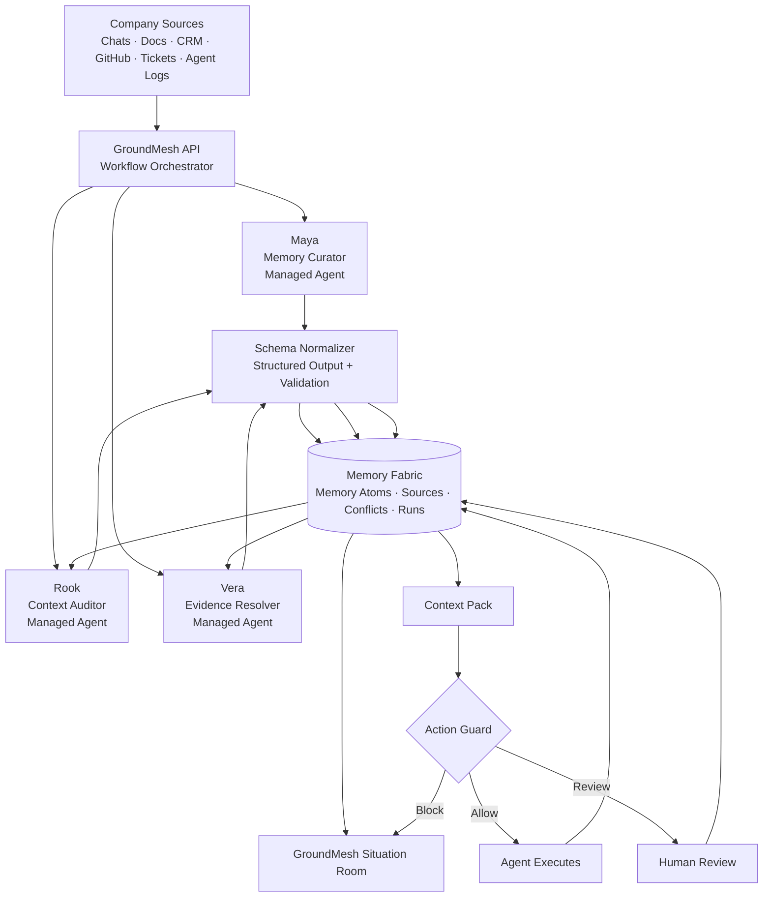
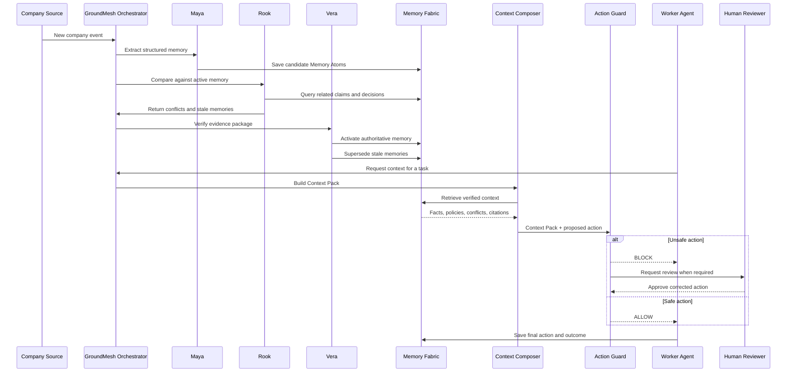

# GroundMesh

> **Verified context for every human and agent.**

GroundMesh is a self-healing organizational context layer for agentic companies. It turns fragmented company knowledge into structured, source-backed memory, detects stale or conflicting information, builds task-specific Context Packs, and blocks unsafe agent actions before they reach customers or internal systems.

Built for the **Cerebral Valley × Google DeepMind Bangalore Hackathon**.

**Track 2 — Autonomous Orchestration with Managed Agents**

---


## Demo Video

<p align="center">
  <a href="https://www.youtube.com/watch?v=5btGUtNa9Ks">
    
  </a>
</p>

<p align="center">
  <strong>▶ Watch the GroundMesh demo</strong>
</p>

> The preview above is displayed directly in the README and opens the full demo when clicked.

---

## Table of Contents

- [Demo Video](#demo-video)
- [The Problem](#the-problem)
- [What GroundMesh Does](#what-groundmesh-does)
- [Core Idea](#core-idea)
- [Key Concepts](#key-concepts)
- [Agent Team](#agent-team)
- [System Architecture](#system-architecture)
- [End-to-End Workflow](#end-to-end-workflow)
- [Product Experience](#product-experience)
- [Demo Scenario](#demo-scenario)
- [Technology Stack](#technology-stack)
- [Repository Structure](#repository-structure)
- [Getting Started](#getting-started)
- [Environment Variables](#environment-variables)
- [API Surface](#api-surface)
- [Core Data Model](#core-data-model)
- [Real-Time Run Events](#real-time-run-events)
- [Safety Principles](#safety-principles)
- [Roadmap](#roadmap)
- [Team](#team)
- [License](#license)

---

## The Problem

Company knowledge is scattered across:

- chat messages
- product documents
- support tickets
- GitHub issues
- CRM notes
- meeting transcripts
- internal tools
- agent execution logs
- undocumented human decisions

As companies deploy more AI agents, this fragmentation becomes more dangerous. Different agents may read different versions of the truth and confidently take conflicting actions.

| Source | Current information |
|---|---|
| Product roadmap | SSO planned for Q3 |
| Sales CRM | Customer was told “next month” |
| Support macro | “SSO is coming soon” |
| GitHub issue | Security review is still open |
| Founder message | Do not commit to a release date |

A traditional RAG system may retrieve all five sources and leave the model to guess.

GroundMesh does not stop at retrieval. It verifies what is authoritative, identifies stale memories, creates a task-specific Context Pack, and checks whether an agent should be allowed to act.

---

## What GroundMesh Does

GroundMesh uses a coordinated team of agents to:

1. ingest company events and source material;
2. extract structured facts, decisions, policies, risks, tasks, and commitments;
3. detect contradictions across sources;
4. identify stale or superseded knowledge;
5. verify the most authoritative version of the truth;
6. create role-specific and task-specific Context Packs;
7. allow, warn, block, or escalate proposed agent actions;
8. write approved outcomes back into organizational memory.

---

## Core Idea

Most company-brain products follow this flow:

```text
Search → Retrieve → Answer
```

GroundMesh follows a stronger operational loop:

```text
Ingest
  ↓
Extract
  ↓
Detect conflicts
  ↓
Check freshness
  ↓
Verify evidence
  ↓
Compose context
  ↓
Guard action
  ↓
Act or escalate
  ↓
Write outcome back to memory
```

The result is not only a better answer. It is a safer organizational action.

---

## Key Concepts

### Memory Atoms

GroundMesh stores important knowledge as **Memory Atoms** instead of relying only on raw document chunks.

A Memory Atom can include:

- type
- subject
- claim
- source
- source timestamp
- authority score
- confidence score
- freshness score
- validity period
- linked entities
- affected agents
- superseded memories
- current status

Example:

```json
{
  "id": "mem_sso_014",
  "type": "decision",
  "subject": "Enterprise SSO release",
  "claim": "No external release date should be committed",
  "source_type": "founder_message",
  "source_id": "slack_882",
  "source_timestamp": "2026-07-11T10:30:00+05:30",
  "authority_score": 0.95,
  "confidence_score": 0.97,
  "freshness_score": 1.0,
  "status": "active",
  "supersedes": [
    "mem_sso_006",
    "mem_sso_009"
  ],
  "applies_to": [
    "sales_agent",
    "support_agent",
    "customer_success_agent"
  ],
  "entities": [
    "project_enterprise_sso",
    "customer_acme"
  ]
}
```

### Conflict Detection

GroundMesh finds incompatible claims about the same topic.

```text
Sales CRM:
“SSO launches next month.”

Founder decision:
“No external release date is approved.”
```

The contradiction is made visible, ranked by severity, and sent through a verification workflow.

### Freshness and Supersession

GroundMesh tracks when information becomes outdated.

Older memories can be marked as:

- stale
- superseded
- expired
- disputed
- unsafe for external use

### Context Packs

Agents do not query raw company data directly. They request a task-specific **Context Pack**.

```json
{
  "requesting_agent": "support_agent",
  "task": "reply_to_customer",
  "customer": "Acme",
  "topic": "Enterprise SSO",
  "verified_facts": [
    "SSO remains under development",
    "No external release date is approved"
  ],
  "applicable_policies": [
    "Do not communicate uncommitted roadmap dates"
  ],
  "known_conflicts": [
    "An older CRM note suggested an August launch"
  ],
  "blocked_claims": [
    "SSO will launch next month"
  ],
  "recommended_action": {
    "type": "reply_without_date",
    "message": "SSO remains a priority and is under active development, but we do not currently have a confirmed release date to share."
  },
  "citations": [
    "founder_decision_14",
    "github_issue_82",
    "roadmap_update_31"
  ]
}
```

### Action Guard

GroundMesh checks proposed actions before execution.

Possible outcomes:

```text
ALLOW
ALLOW_WITH_WARNING
REQUIRE_APPROVAL
BLOCK
```

The language model interprets meaning and extracts claims. Application code enforces the final policy decision wherever possible.

---

## Agent Team

GroundMesh uses three human-like managed agents and one deterministic enforcement layer.

### Maya — Memory Curator

Maya understands what changed.

**Responsibilities**

- extract Memory Atoms;
- separate facts from decisions and assumptions;
- preserve source wording;
- link memories to projects, customers, people, and policies;
- identify uncertainty;
- classify affected teams and agents.

> “I found one decision, one policy, and one customer-impacting commitment.”

### Rook — Context Auditor

Rook challenges what the company thinks it knows.

**Responsibilities**

- find contradictions;
- detect stale memories;
- identify superseded decisions;
- flag unsupported commitments;
- estimate conflict severity;
- identify affected workflows.

> “The active sales commitment conflicts with the new founder decision.”

### Vera — Evidence Resolver

Vera decides what is currently authoritative.

**Responsibilities**

- compare source authority;
- evaluate recency;
- check supporting evidence;
- preserve unresolved uncertainty;
- resolve or escalate conflicts;
- produce verified context.

> “The founder decision is newer, more authoritative, and supported by the open security-review issue.”

### Action Guard

Action Guard is not another conversational agent. It is the policy-enforcement layer.

It checks:

- blocked claims;
- unresolved high-severity conflicts;
- context confidence;
- policy scope;
- approval requirements.

---

## System Architecture



---

## End-to-End Workflow



---

## Product Experience

GroundMesh uses a creative, human-like interface called the **Situation Room**.

It is designed to feel like an intelligent operations team working around shared evidence rather than a standard analytics dashboard.

### Situation Room Layout

```text
┌─────────────────────────────────────────────────────────────┐
│ GROUNDMESH                  CONTEXT STATUS: CONFLICT FOUND   │
├───────────────┬───────────────────────────┬─────────────────┤
│ SOURCE INBOX  │      SHARED EVIDENCE      │   AGENT TEAM    │
│               │          TABLE            │                 │
│ Founder note  │                           │ Maya    Working │
│ CRM promise   │    SSO Decision Graph     │ Rook    Auditing│
│ GitHub issue  │                           │ Vera    Waiting │
│ Support macro │    Conflict threads       │                 │
├───────────────┴───────────────────────────┴─────────────────┤
│ ACTION GATE: Proposed customer reply                        │
│ [Review evidence] [Edit reply] [Approve]                    │
└─────────────────────────────────────────────────────────────┘
```

### Main Screens

- Morning Brief
- Live Situation Room
- Memory Explorer
- Conflict Room
- Context Pack Playground
- Human Resolution Inbox
- Agent Run Replay

---

## Demo Scenario

The live hackathon demo uses one clear scenario.

### Existing Information

1. Product roadmap: SSO planned for Q3.
2. Sales CRM: Acme was told SSO may launch next month.
3. Support macro: SSO is coming soon.
4. GitHub issue: Security review is incomplete.

### New Event

The founder sends:

> “Enterprise SSO is delayed. Do not commit to a public release date.”

### GroundMesh Response

1. Maya extracts the decision and communication policy.
2. Rook finds conflicts with the roadmap, CRM, and support macro.
3. Vera verifies the founder message as the active authority.
4. Older claims are marked stale or superseded.
5. A support agent proposes: “SSO will launch next month.”
6. GroundMesh generates a support-specific Context Pack.
7. Action Guard blocks the message.
8. GroundMesh recommends a safe reply.
9. A human approves the correction.
10. The approved response is written back into shared memory.

---

## Technology Stack

### Hackathon Runtime

- Antigravity Managed Agents
- Gemini
- Interactions API
- structured-output calls
- Next.js
- TypeScript
- Tailwind CSS
- shadcn/ui
- Framer Motion
- Supabase PostgreSQL
- pgvector
- Supabase Realtime
- Vercel

### Post-Hackathon Runtime

The application is provider-agnostic.

After temporary Gemini credits expire:

- local Gemma models handle curation and lightweight auditing;
- local embeddings handle retrieval;
- paid API calls are reserved for difficult verification;
- Supabase remains the durable memory layer;
- Action Guard remains deterministic;
- the UI and schemas do not change.

---

## Repository Structure

```text
groundmesh/
├── app/
│   ├── page.tsx
│   ├── memory/
│   ├── conflicts/
│   ├── runs/
│   ├── approvals/
│   └── api/
│       ├── events/ingest/route.ts
│       ├── actions/check/route.ts
│       ├── context-pack/route.ts
│       ├── reviews/route.ts
│       └── runs/[id]/route.ts
│
├── components/
│   ├── situation-room/
│   ├── evidence/
│   ├── agents/
│   ├── action-gate/
│   └── memory/
│
├── lib/
│   ├── agents/
│   │   ├── maya.ts
│   │   ├── rook.ts
│   │   └── vera.ts
│   ├── providers/
│   │   ├── managed-agent.ts
│   │   ├── structured-model.ts
│   │   └── openai-compatible.ts
│   ├── orchestration/
│   │   └── groundmesh-workflow.ts
│   ├── normalization/
│   ├── guard/
│   │   └── action-guard.ts
│   ├── schemas/
│   └── supabase/
│
├── agents/
│   ├── maya/
│   │   ├── AGENTS.md
│   │   └── skills/
│   ├── rook/
│   │   ├── AGENTS.md
│   │   └── skills/
│   └── vera/
│       ├── AGENTS.md
│       └── skills/
│
├── supabase/
│   └── migrations/
│
├── demo-data/
│   ├── roadmap.json
│   ├── sales-crm.json
│   ├── support-macros.json
│   └── github-issues.json
│
├── public/
├── .env.example
├── package.json
└── README.md
```

---

## Getting Started

### Prerequisites

- Node.js 20+
- npm, pnpm, or bun
- Supabase project
- Gemini API access
- Antigravity / Managed Agents access
- Vercel account for deployment

### Clone the Repository

```bash
git clone https://github.com/<your-username>/groundmesh.git
cd groundmesh
```

### Install Dependencies

```bash
npm install
```

### Configure Environment Variables

Copy the example environment file:

```bash
cp .env.example .env.local
```

Then add your credentials as described below.

### Apply Database Migrations

```bash
npx supabase db push
```

### Seed the Demo Workspace

```bash
npm run seed:demo
```

### Start the Development Server

```bash
npm run dev
```

Open [http://localhost:3000](http://localhost:3000).

---

## Environment Variables

```env
NEXT_PUBLIC_SUPABASE_URL=
NEXT_PUBLIC_SUPABASE_ANON_KEY=
SUPABASE_SERVICE_ROLE_KEY=

GEMINI_API_KEY=
ANTIGRAVITY_AGENT_MODEL=
GEMINI_STRUCTURED_MODEL=

NEXT_PUBLIC_APP_URL=http://localhost:3000
```

Use the exact model and managed-agent identifiers enabled for your hackathon account.

---

## API Surface

### Ingest a Company Event

```http
POST /api/events/ingest
```

```json
{
  "source_type": "founder_message",
  "title": "Enterprise SSO update",
  "content": "Enterprise SSO is delayed. Do not commit to a public release date.",
  "source_timestamp": "2026-07-11T10:30:00+05:30",
  "metadata": {
    "author_role": "founder",
    "project": "Enterprise SSO"
  }
}
```

### Generate a Context Pack

```http
POST /api/context-pack
```

```json
{
  "agent": "support_agent",
  "task": "reply_to_customer",
  "entity": "Acme",
  "topic": "Enterprise SSO"
}
```

### Check a Proposed Action

```http
POST /api/actions/check
```

```json
{
  "agent": "support_agent",
  "customer": "Acme",
  "topic": "Enterprise SSO",
  "proposed_action": "Tell Acme that SSO launches next month."
}
```

### Resolve a Human-Review Item

```http
POST /api/reviews
```

```json
{
  "review_id": "review_014",
  "decision": "approve_correction",
  "final_message": "SSO remains a priority and is under active development, but we do not currently have a confirmed release date to share."
}
```

---

## Core Data Model

Recommended MVP tables:

- `source_events`
- `memory_atoms`
- `memory_edges`
- `conflicts`
- `agent_runs`
- `run_events`
- `context_packs`
- `action_checks`
- `human_reviews`

A production release should add workspace isolation, role-based access control, retention rules, and audit exports.

---

## Real-Time Run Events

The Situation Room reacts to real backend events.

```typescript
type RunEvent =
  | { type: "source_received"; sourceId: string }
  | { type: "agent_started"; agent: "maya" | "rook" | "vera" }
  | { type: "memory_extracted"; count: number }
  | { type: "conflict_detected"; conflictId: string }
  | { type: "stale_memory_detected"; memoryIds: string[] }
  | { type: "evidence_verified"; confidence: number }
  | { type: "memory_superseded"; memoryIds: string[] }
  | { type: "context_pack_ready"; packId: string }
  | { type: "action_blocked"; reason: string }
  | { type: "human_review_required"; reviewId: string }
  | { type: "run_completed"; runId: string };
```

---

## Safety Principles

GroundMesh follows these principles:

- no external action without a Context Pack;
- no high-impact action with unresolved severe conflicts;
- no silent overwrite of organizational memory;
- all supersession decisions remain auditable;
- human review is required when confidence is insufficient;
- sources and citations are preserved;
- model output is validated before database writes;
- deterministic guard rules override model confidence;
- demo actions use mock systems unless explicitly approved.

---

## Roadmap

### Hackathon MVP

- seeded company sources;
- managed-agent orchestration;
- Memory Atom extraction;
- conflict detection;
- freshness detection;
- evidence verification;
- Context Pack generation;
- deterministic Action Guard;
- human approval;
- run replay;
- cinematic Situation Room UI.

### Post-Hackathon

- local model support;
- local embeddings;
- Google Drive connector;
- Slack connector;
- GitHub connector;
- role-based access controls;
- workspace isolation;
- memory-quality evaluation;
- policy simulation;
- multilingual context normalization;
- production observability.

### Longer-Term

- agent-to-agent context protocol;
- temporal organizational knowledge graph;
- policy-as-code integration;
- proactive organizational drift alerts;
- autonomous documentation repair with approval;
- enterprise audit exports;
- private-cloud and on-device deployments.

---

## Why GroundMesh Matters

AI agents do not only need access to more information.

They need:

- the correct information;
- the latest information;
- the information relevant to their task;
- the policies that constrain their actions;
- evidence explaining why the context is trusted.

GroundMesh is the control layer between organizational knowledge and agent action.

> **Not just search. Not just chat. Verified context before action.**

---

## Team

Built by **Shivansh Gupta** for the Cerebral Valley × Google DeepMind Bangalore Hackathon.

---

## License

Choose and add a license before public release.

Recommended options:

- **Apache-2.0** for broad open-source use with an explicit patent grant;
- **MIT** for maximum simplicity;
- **Business Source License** if commercial-use restrictions are required.

---

## Acknowledgements

Built with the Google AI stack, Antigravity managed-agent capabilities, Gemini models, Supabase, Next.js, and the broader open-source ecosystem.

---

<p align="center">
  <strong>GroundMesh</strong><br />
  Verified context for every human and agent.
</p>
